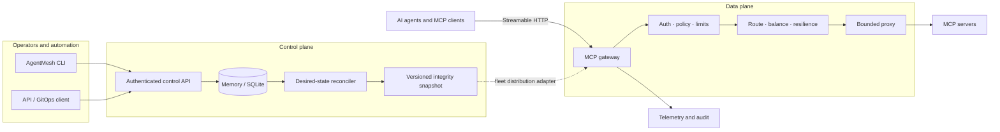
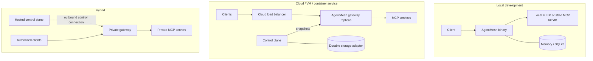
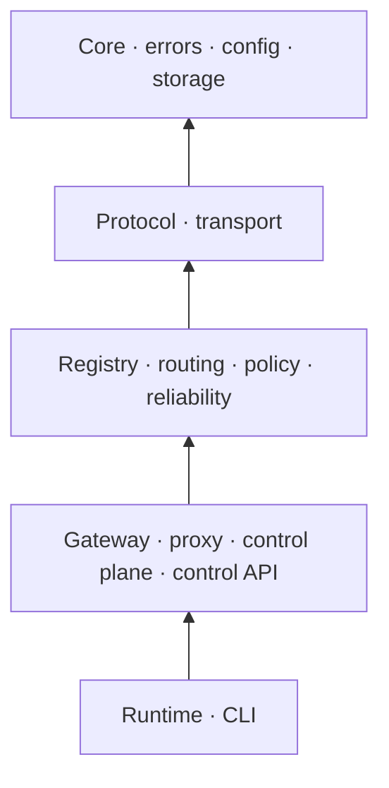

<div align="center">

# AgentMesh

### The service mesh for AI tools

**Discover, route, secure, and observe Model Context Protocol infrastructure from one endpoint.**

[](https://github.com/devdanielvaldez/agentmesh/actions/workflows/ci.yml)
[](https://github.com/devdanielvaldez/agentmesh/actions/workflows/security.yml)
[](LICENSE)
[](https://www.rust-lang.org/)
[](docs/PROTOCOL_SUPPORT.md)
[](#project-status)

[Get started](#quick-start) · [How it works](#how-agentmesh-works) · [CLI](#cli-reference) · [Documentation](#documentation) · [Contributing](CONTRIBUTING.md)

</div>

---

AgentMesh is an open-source gateway and service mesh for the
[Model Context Protocol](https://modelcontextprotocol.io/). MCP clients connect to one logical
endpoint while AgentMesh validates the protocol, isolates credentials, applies governance,
selects a healthy upstream, and records safe operational signals.

> [!IMPORTANT]
> AgentMesh is pre-release software. The local gateway, SQLite control plane, and core platform
> contracts are implemented and tested, but production HA adapters and compatibility guarantees are
> still evolving. Do not use it as the sole protection for sensitive production credentials yet.

## Why AgentMesh?

Direct MCP connections are simple, but every client otherwise has to solve the same operational
problems independently. AgentMesh centralizes those concerns without requiring a proprietary client
SDK or tying infrastructure to one model provider.

| Capability | What it provides |
| --- | --- |
| Unified access | One MCP endpoint for approved tools, resources, prompts, and tasks. |
| Deterministic routing | Tenant-, identity-, capability-, version-, label-, and region-aware decisions. |
| Resilient traffic | Health filtering, load balancing, deadlines, safe retries, bulkheads, and circuit breakers. |
| Security and governance | Authentication, RBAC, contextual policy, approvals, rate limits, SSRF controls, and credential isolation. |
| Control plane | Versioned desired state, optimistic concurrency, integrity-protected snapshots, and rollout status. |
| Observability | W3C trace context, bounded metrics/events, redacted logs, and tamper-evident audit records. |
| Flexible operation | Native binary or container on a laptop, VM, container service, or private network. |

## How AgentMesh works

AgentMesh is designed to separate configuration from traffic. The implemented control plane compiles
desired state into immutable snapshots, and the data-plane contracts consume immutable state without
querying control-plane storage on the request path. Fleet snapshot delivery is a forthcoming adapter;
the current executable gateway uses the static upstream from its YAML configuration.



The gateway crate defines this explicit, fail-closed middleware order. The current static executable
path exercises admission, protocol validation, proxying, response validation, and telemetry; the
remaining stages are implemented as composable modules and are being wired into snapshot-driven
runtime assembly.

```mermaid
flowchart LR
    A[Admission] --> B[Protocol validation]
    B --> C[Authentication]
    C --> D[Authorization and policy]
    D --> E[Rate and concurrency limits]
    E --> F[Capability resolution]
    F --> G[Route and endpoint selection]
    G --> H[Deadline and resilience guards]
    H --> I[Credential-safe proxy]
    I --> J[Response validation]
    J --> K[Accounting · telemetry · audit]
```



For the deeper design, see [Technical Architecture](docs/T_ARCHITECTURE.md),
[Control Plane](docs/CONTROL_PLANE.md), and the [architecture decisions](docs/adr/README.md).

## Quick start

### Prerequisites

- Rust `1.85` or newer, installed through [rustup](https://rustup.rs/).
- Git.
- Optional: Docker with Compose for the container workflow.
- An MCP Streamable HTTP server if you want to proxy real requests.

### 1. Clone and build

```bash
git clone https://github.com/devdanielvaldez/agentmesh.git
cd agentmesh
cargo build --locked -p agentmesh
```

### 2. Configure a gateway

Copy the example and edit the upstream URL:

```bash
cp config/agentmesh.example.yaml config/agentmesh.local.yaml
```

```yaml
gateway:
  host: 127.0.0.1
  port: 8080
  upstream:
    url: http://127.0.0.1:3001/mcp
    allow_insecure_http: true # local development only
    request_timeout_ms: 30000

telemetry:
  json: false
  filter: agentmesh=info,tower_http=info
```

Validate before starting:

```bash
cargo run -p agentmesh -- validate config/agentmesh.local.yaml
cargo run -p agentmesh -- doctor --config config/agentmesh.local.yaml
```

### 3. Start the gateway

```bash
cargo run -p agentmesh -- serve --config config/agentmesh.local.yaml
```

Check its operational endpoints:

```bash
curl --fail http://127.0.0.1:8080/
curl --fail --include http://127.0.0.1:8080/health/live
curl --fail --include http://127.0.0.1:8080/health/ready
```

The MCP endpoint is `POST /mcp`. Requests must use `application/json`, a compatible
`MCP-Protocol-Version` header, and valid MCP metadata. See
[Protocol Support](docs/PROTOCOL_SUPPORT.md) for accepted versions and compatibility behavior.

### 4. Start the local control plane

Use a token of at least 16 bytes. The plaintext token is used only for verification setup; the API
state stores its SHA-256 digest.

```bash
export AGENTMESH_ADMIN_TOKEN='replace-with-a-long-random-token'
cargo run -p agentmesh -- control-plane \
  --host 127.0.0.1 \
  --port 8081 \
  --database agentmesh-control.db
```

Check the authenticated API:

```bash
curl --fail \
  --header "Authorization: Bearer ${AGENTMESH_ADMIN_TOKEN}" \
  http://127.0.0.1:8081/v1/status
```

### 5. Apply and compile desired state

A desired-state document has a `kind`, unique `name`, lifecycle `state`, and module-specific `spec`:

```json
{
  "kind": "route",
  "name": "search-primary",
  "state": "active",
  "spec": {
    "service": "search",
    "capability": "search.query",
    "strategy": "least_active"
  }
}
```

Save it as `route.json`, then use the CLI:

```bash
export AGENTMESH_CONTROL_URL='http://127.0.0.1:8081'

cargo run -p agentmesh -- apply \
  --control-url "$AGENTMESH_CONTROL_URL" \
  --tenant acme \
  --namespace development \
  route.json

cargo run -p agentmesh -- reconcile \
  --control-url "$AGENTMESH_CONTROL_URL" \
  --tenant acme \
  --namespace development

cargo run -p agentmesh -- snapshot \
  --control-url "$AGENTMESH_CONTROL_URL" \
  --tenant acme \
  --namespace development
```

The CLI reads the token from `AGENTMESH_ADMIN_TOKEN`. An update must include the current resource
revision with `--revision`; stale writes fail with `409 Conflict`.

## Run with Docker

The default Compose service starts the gateway on port `8080` using `config/agentmesh.yaml`:

```bash
docker compose up --build
docker compose ps
curl --fail http://127.0.0.1:8080/health/ready
```

The image is non-root, read-only, drops Linux capabilities, and uses a small temporary filesystem.
Set an HTTPS upstream for any non-local deployment. The control plane currently runs as a separate
binary command so its SQLite database can be mounted on explicit persistent storage.

## Deployment modes



Today, the supported executable paths are a standalone gateway with a static HTTP upstream and a
durable SQLite control plane. The workspace also contains stable contracts for external storage,
distributed coordination, exporters, discovery adapters, and separated runtime profiles. See
[Deployment and Operations](docs/OPERATIONS.md) for current boundaries and safe production-oriented
defaults.

## Configuration

Configuration is strict: unknown YAML keys fail startup instead of being ignored.

| Setting | Default | Description |
| --- | --- | --- |
| `gateway.host` | `0.0.0.0` | Gateway bind address. |
| `gateway.port` | `8080` | Gateway port; zero is rejected. |
| `gateway.upstream.url` | none | Static Streamable HTTP MCP endpoint. |
| `gateway.upstream.allow_insecure_http` | `false` | Permit HTTP; use only for trusted local development. |
| `gateway.upstream.request_timeout_ms` | `30000` | Per-request upstream deadline. |
| `telemetry.json` | `false` | Emit newline-delimited JSON logs. |
| `telemetry.filter` | `agentmesh=info,tower_http=info` | Default tracing filter. |

The standalone binary currently reads gateway values from YAML. `RUST_LOG` overrides the configured
tracing filter. CLI-specific environment variables are:

- `AGENTMESH_CONFIG`
- `AGENTMESH_CONTROL_URL`
- `AGENTMESH_ADMIN_TOKEN`

Generate a machine-readable schema or compare two valid files:

```bash
cargo run -p agentmesh -- schema > agentmesh.schema.json
cargo run -p agentmesh -- diff current.yaml candidate.yaml
```

## CLI reference

| Command | Purpose |
| --- | --- |
| `serve` | Start the MCP data-plane gateway. |
| `control-plane` | Start the authenticated administrative API with SQLite. |
| `validate` | Parse and semantically validate configuration. |
| `schema` | Print configuration JSON Schema. |
| `diff` | Compare two validated configuration files. |
| `doctor` | Check local configuration and resolved listener settings. |
| `apply` | Create or revision-match a desired-state resource. |
| `reconcile` | Compile desired state into the next immutable snapshot. |
| `snapshot` | Retrieve the active snapshot for one tenant and namespace. |

Use `agentmesh <command> --help` for all flags. Complete command and API examples live in the
[User Guide](docs/USER_GUIDE.md).

## Security model

AgentMesh treats every external value as untrusted and every tenant boundary as explicit.

- Caller credentials and hop-by-hop headers are not forwarded by default.
- Secret values use opaque references and redacted wrappers.
- Egress policy blocks private, loopback, link-local, metadata, and rebinding destinations unless
  an explicit trusted policy allows them.
- Configuration, messages, sessions, caches, plugin calls, events, and audit queues are bounded.
- Explicit authorization deny takes precedence over allow.
- Mutating operations are not retried without a verified idempotency mechanism.
- Administrative mutations use bearer authentication and optimistic concurrency.
- Audit records form a tamper-evident SHA-256 chain.

Read [Security and Observability](docs/SECURITY_OBSERVABILITY.md) for implementation details. Report
vulnerabilities privately according to [SECURITY.md](SECURITY.md).

## Repository architecture

The Rust workspace contains 31 focused modules. The major groups are:

| Area | Crates |
| --- | --- |
| Foundation | `agentmesh-core`, `agentmesh-error`, `agentmesh-config`, `agentmesh-storage` |
| Protocol and transport | `agentmesh-protocol`, `agentmesh-transport`, `agentmesh-proxy` |
| Data plane | `agentmesh-gateway`, `agentmesh-registry`, `agentmesh-discovery`, `agentmesh-router` |
| Reliability | `agentmesh-load-balancer`, `agentmesh-health`, `agentmesh-circuit-breaker`, `agentmesh-resilience`, `agentmesh-tasks` |
| Governance | `agentmesh-authn`, `agentmesh-authz`, `agentmesh-policy`, `agentmesh-rate-limit`, `agentmesh-credentials`, `agentmesh-security` |
| Operations | `agentmesh-cache`, `agentmesh-telemetry`, `agentmesh-audit` |
| Platform | `agentmesh-control-plane`, `agentmesh-control-api`, `agentmesh-runtime`, `agentmesh-plugins`, `agentmesh-testkit`, `agentmesh` |

Dependency direction is intentionally one-way:



## Development

```bash
cargo fmt --all -- --check
cargo test --workspace --all-features --locked
cargo clippy --workspace --all-targets --all-features --locked -- -D warnings
RUSTDOCFLAGS="-D warnings" cargo doc --workspace --no-deps --locked
```

The repository enforces formatting, linting, tests, minimum supported Rust, dependency review, and
security audit checks in GitHub Actions. See [CONTRIBUTING.md](CONTRIBUTING.md) before submitting a
change.

## Documentation

| Guide | Audience |
| --- | --- |
| [Documentation index](docs/README.md) | Everyone |
| [User Guide](docs/USER_GUIDE.md) | Users and evaluators |
| [Deployment and Operations](docs/OPERATIONS.md) | Platform and SRE teams |
| [Technical Architecture](docs/T_ARCHITECTURE.md) | Maintainers and architects |
| [Protocol Support](docs/PROTOCOL_SUPPORT.md) | MCP implementers |
| [Transports](docs/TRANSPORTS.md) | Client/server integrators |
| [Registry](docs/REGISTRY.md) and [Discovery](docs/DISCOVERY.md) | Platform engineers |
| [Governance](docs/GOVERNANCE.md) | Security teams |
| [Traffic Reliability](docs/TRAFFIC_RELIABILITY.md) | SRE teams |
| [Security and Observability](docs/SECURITY_OBSERVABILITY.md) | Security and operations teams |
| [Control Plane](docs/CONTROL_PLANE.md) | Operators and automation authors |
| [Architecture decisions](docs/adr/README.md) | Contributors |

## Roadmap

The core module architecture is implemented. Near-term work focuses on production adapters and
operator experience:

- external identity and secret providers;
- PostgreSQL/Redis and production telemetry/audit exporters;
- virtual MCP servers and dynamic catalog filtering;
- dashboard, Kubernetes manifests, Helm, and GitOps workflows;
- multi-region and multi-cluster hardening.

Track sequencing and scope in [ROADMAP.md](ROADMAP.md).

## Project status

AgentMesh is under active pre-release development. APIs, configuration, and persistence formats may
change before `1.0`. Only the latest commit on `main` is supported.

## Community and support

- Read [SUPPORT.md](SUPPORT.md) for help and support expectations.
- Use [GitHub Discussions](https://github.com/devdanielvaldez/agentmesh/discussions) for questions and
  design proposals.
- Use the issue templates for reproducible bugs, scoped features, and documentation problems.
- Follow [CODE_OF_CONDUCT.md](CODE_OF_CONDUCT.md) in all project spaces.
- Report vulnerabilities privately through [GitHub Security Advisories](https://github.com/devdanielvaldez/agentmesh/security/advisories/new).

## License

AgentMesh is available under the [MIT License](LICENSE).
