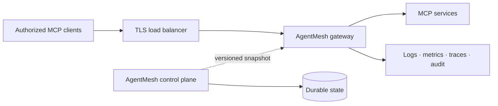

# Deployment and operations

This guide distinguishes what can be run today from the production adapters on the roadmap.

## Supported executable topology

The current binary supports two commands that can run as separate processes:

- `agentmesh serve`: an MCP data plane with a validated static Streamable HTTP upstream;
- `agentmesh control-plane`: an authenticated administrative API with durable SQLite state.

Core crates also implement routing, registry, discovery, reliability, governance, telemetry, audit,
runtime profiles, and snapshot contracts. Fleet snapshot distribution and managed PostgreSQL/Redis
adapters remain future integrations.

## Local deployment

Use loopback listeners and an isolated SQLite file:

```bash
agentmesh serve --config config/agentmesh.local.yaml
AGENTMESH_ADMIN_TOKEN='replace-with-a-long-random-token' \
  agentmesh control-plane --database ./state/agentmesh-control.db
```

Back up the SQLite file only with a SQLite-aware method or while the process is stopped. Do not copy
an active database file as if it were an ordinary static document.

## Container deployment

The project image uses a distroless non-root runtime. Recommended controls:

- keep the root filesystem read-only;
- drop all Linux capabilities;
- set `no-new-privileges`;
- mount configuration read-only;
- provide a small writable `/tmp` only when necessary;
- expose the gateway behind TLS termination;
- mount control-plane state on a dedicated persistent volume;
- inject administrative tokens from the platform secret mechanism, never from an image layer.

The included `compose.yaml` demonstrates the gateway hardening baseline.

## Cloud and hybrid placement



For hybrid networks, keep MCP servers and gateways close together. Prefer outbound-only control
connections once fleet distribution is available. Treat capability metadata as potentially
sensitive and apply residency policy before exporting it.

## Readiness and liveness

| Endpoint | Meaning |
| --- | --- |
| `GET /health/live` | The gateway process and HTTP runtime are alive. |
| `GET /health/ready` | The gateway is ready according to its current embedded dependencies. |
| `GET /` | Build version and service status. |
| `GET /v1/status` | Authenticated control API status. |

Do not use liveness as a substitute for readiness. A load balancer should remove an unready gateway
without restarting a process that is still capable of recovery.

## Security baseline

- Terminate TLS at the process or a trusted adjacent proxy; never expose development HTTP publicly.
- Bind the control API to a private interface and restrict it with network policy.
- Generate a high-entropy administrative token and rotate it through a coordinated restart.
- Store only secret references in desired state.
- Keep egress allowlists narrow and block cloud metadata endpoints.
- Keep configuration and SQLite files readable only by the runtime identity.
- Preserve audit data outside an ephemeral container filesystem when using it for investigations.
- Pin the container or binary to a release digest and verify the `.sha256` file published beside
  each release archive.

## Capacity and bounds

AgentMesh uses explicit bounds for external inputs, catalog sizes, sessions, queues, caches, plugin
payloads, audit buffers, and snapshots. A rejected limit is safer than an unbounded allocation.
Capacity changes should be load-tested with representative MCP payloads and tenant cardinality.

## Upgrade procedure

Until `1.0`, configuration and persistence formats may change.

1. Read [CHANGELOG.md](../CHANGELOG.md) and release notes.
2. Back up persistent state.
3. Validate candidate configuration with the new binary.
4. Run `agentmesh diff` against the active configuration.
5. Deploy one canary instance.
6. Verify readiness, request success, latency, and audit delivery.
7. Roll forward gradually or restore the previous binary and state backup.

## Incident checklist

1. Capture the version, configuration revision, trace ID, and affected tenant scope.
2. Check readiness and upstream reachability without logging credentials or tool arguments.
3. Review circuit, health, rate-limit, policy, and audit signals.
4. Disable or quarantine the affected destination rather than deleting evidence.
5. Rotate exposed credentials through their source provider.
6. Preserve relevant audit and structured log records.
7. Report suspected product vulnerabilities through the private process in
   [SECURITY.md](../SECURITY.md).

## Current production gaps

The architecture has contracts for these capabilities, but the repository does not yet claim their
managed production implementations:

- PostgreSQL and distributed coordination adapters;
- fleet snapshot transport between separate processes;
- managed identity, cloud secret-manager, and external policy providers;
- Prometheus/OpenTelemetry production exporters and durable external audit sinks;
- Kubernetes manifests, Helm, dashboard, and multi-cluster operations.

Track those items in [ROADMAP.md](../ROADMAP.md).
