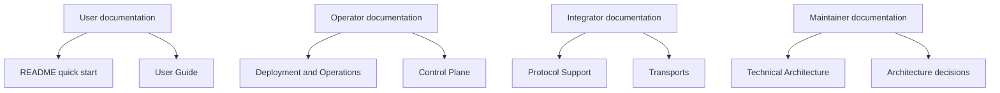

# AgentMesh documentation

This directory contains the user, operator, protocol, and architecture documentation for
AgentMesh. Start with the path that matches your role.

## Choose your path

| I want to… | Start here |
| --- | --- |
| Run AgentMesh locally | [User Guide](USER_GUIDE.md) |
| Deploy or operate it | [Deployment and Operations](OPERATIONS.md) |
| Understand the system design | [Technical Architecture](T_ARCHITECTURE.md) |
| Integrate an MCP client or server | [Protocol Support](PROTOCOL_SUPPORT.md) and [Transports](TRANSPORTS.md) |
| Manage desired state | [Control Plane](CONTROL_PLANE.md) |
| Understand routing and failure behavior | [Traffic Reliability](TRAFFIC_RELIABILITY.md) |
| Review identity and policy | [Governance](GOVERNANCE.md) |
| Review security controls | [Security and Observability](SECURITY_OBSERVABILITY.md) |
| Extend discovery or catalogs | [Discovery](DISCOVERY.md) and [Registry](REGISTRY.md) |
| Contribute an architectural change | [Architecture Decisions](adr/README.md) |

## System map

## Documentation conventions

- Commands are written from the repository root unless stated otherwise.
- Examples use `127.0.0.1` and insecure HTTP only for local development.
- Replace example tokens and tenant names before using any shared environment.
- Features described as *implemented* are present in the current workspace. Items described as
  adapters or roadmap work are not claimed as production-ready integrations.
- Security vulnerabilities must be reported through the private process in
  [SECURITY.md](../SECURITY.md), not through documentation issues.

When behavior changes, update the README, the relevant guide, configuration examples, and
[CHANGELOG.md](../CHANGELOG.md) in the same pull request.
