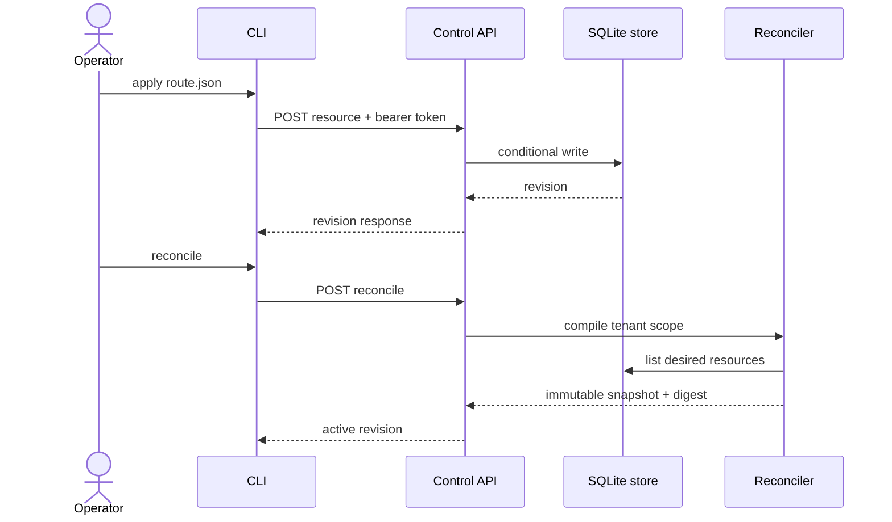

# AgentMesh user guide

This guide walks through the two executable surfaces available today:

1. the MCP gateway, which validates and proxies traffic to an upstream server;
2. the local control plane, which stores desired resources and compiles immutable snapshots.

## Install

### Build from source

```bash
git clone https://github.com/devdanielvaldez/agentmesh.git
cd agentmesh
cargo build --release --locked -p agentmesh
./target/release/agentmesh --help
export PATH="$PWD/target/release:$PATH"
```

The minimum supported Rust version is declared in `rust-toolchain.toml` and enforced in CI.

### Use the container image locally

```bash
docker build --tag agentmesh:local .
docker run --rm --read-only \
  --publish 8080:8080 \
  --volume "$PWD/config/agentmesh.yaml:/etc/agentmesh/agentmesh.yaml:ro" \
  agentmesh:local
```

## Gateway workflow

### Configure the listener and upstream

```yaml
gateway:
  host: 127.0.0.1
  port: 8080
  upstream:
    url: http://127.0.0.1:3001/mcp
    allow_insecure_http: true
    request_timeout_ms: 30000

telemetry:
  json: false
  filter: agentmesh=debug,tower_http=info
```

`allow_insecure_http` defaults to `false`. Keep that default for remote upstreams. Static upstream
URLs are validated before the listener starts.

### Multiple upstreams

Use `upstreams` (a list, mutually exclusive with `upstream`) to serve several
MCP servers from one gateway:

```yaml
gateway:
  host: 127.0.0.1
  port: 8080
  upstreams:
    - url: http://127.0.0.1:3001/mcp
      allow_insecure_http: true
      request_timeout_ms: 30000
    - url: http://127.0.0.1:3002/mcp
      allow_insecure_http: true
      request_timeout_ms: 30000
```

Routing semantics with more than one upstream:

- `tools/list`, `resources/list`, `resources/templates/list`, `prompts/list`
  fan out and merge (JSON is forced so pages can combine).
- `tools/call` and `prompts/get` route by discovered name;
  `resources/read` and the subscription methods route by discovered URI.
  Unknown names return `CAPABILITY_NOT_FOUND`.
- `ping` fans out; every upstream must answer. Notifications broadcast to all.
- Any other method (including `server/discover`, `initialize`, tasks) is
  rejected with `INVALID_REQUEST`: it needs a single upstream.
- Duplicate capability names resolve to the first upstream in config order.
- Paginated catalogs (`nextCursor`) cannot merge and are rejected.
- Startup discovery is fail-closed on `tools/list`: if any upstream cannot
  be listed, the gateway refuses to start rather than serving a partial mesh.
  The other families are optional per upstream — servers that do not implement
  them (bridges answer HTTP 404 with "method not found") simply contribute
  nothing to those merges.

### Policy routing engine

`gateway.policies` turns the gateway into policy-driven MCP traffic
management. Rules evaluate in file order and the first match wins; requests
no rule matches are allowed. Each rule combines one selector with up to four
effects:

```yaml
gateway:
  environment: development
  upstreams:
    - url: http://127.0.0.1:3001/mcp
      name: github-prod
      allow_insecure_http: true
    - url: http://127.0.0.1:3002/mcp
      name: github-free
      allow_insecure_http: true
  policies:
    # Reads go to the free mirror, everything else stays discovered.
    - match: { tool: "github.get_*" }
      route: github-free
    # Destructive actions stay out of development.
    - match: { tool: "stripe.refund", environment: development }
      deny: Refunds are disabled in development.
    # Paid APIs get an hourly budget (429 QUOTA_EXCEEDED when exhausted).
    - match: { tool: "maps.*" }
      budget: { calls_per_hour: 100 }
    # Sensitive fields never reach the upstream.
    - match: { tool: "crm.*" }
      redact: ["customer.ssn", "customer.credit_card"]
```

Selector semantics:

- `tool` is a glob (`*`, `?`) matched against the `tools/call` tool name.
- `method` defaults to `tools/call` when `tool` is set, and to every method
  otherwise — so a bare `{ deny: ... }` rule is a global kill-switch.
- `environment` compares against `gateway.environment` (default
  `development`, the fail-safe choice: rules guarding development apply
  unless you explicitly set `production`).

Effect semantics:

- `deny` rejects with `403 POLICY_DENIED` and the configured reason.
- `route` pins matching `tools/call` requests to the named upstream,
  bypassing discovery (unknown names fail startup, fail-closed).
- `budget` enforces a rolling hourly window per rule; exhaustion rejects
  with `429 QUOTA_EXCEEDED`.
- `redact` replaces dotted `arguments` paths with `[REDACTED]` before
  forwarding; missing paths are ignored.

Every decision is recorded in `/metrics` recent events and shown in
`agentmesh monitor` as a trailing `policy` label (`allow`,
`allow:rule0->github-free`, `deny:rule1`, `deny:rule2:budget`,
`allow:rule3+redact2`). Dry-run any call without side effects:

```bash
agentmesh policy --config config/agentmesh.local.yaml --tool github.get_issue
agentmesh policy --config config/agentmesh.local.yaml --tool stripe.refund
```

The command prints the decision, matched rule, route, remaining budget, and
redactions; it exits 2 when the call would be denied. `agentmesh doctor`
also validates policy routes at startup time.

### Validate and inspect

```bash
agentmesh validate config/agentmesh.local.yaml
agentmesh doctor --config config/agentmesh.local.yaml
agentmesh schema > agentmesh.schema.json
agentmesh diff config/current.yaml config/candidate.yaml
```

The commands have these failure semantics:

- `validate` fails on unreadable YAML, unknown keys, invalid addresses, port zero, empty upstream
  URLs, `upstream` combined with `upstreams`, duplicate upstream URLs or names, zero request timeouts,
  empty policy routes, and zero hourly budgets;
- `doctor` prints resolved listener, upstream count, and compiled policy rules after validation;
- `schema` writes JSON Schema to standard output;
- `diff` validates both inputs before reporting a normalized YAML difference.

### Start and stop

```bash
agentmesh serve --config config/agentmesh.local.yaml
```

AgentMesh listens for `SIGINT` and `SIGTERM`, stops accepting new work, and lets Axum perform a
graceful server shutdown.

### Send an MCP request

Modern MCP requests carry the protocol version in both the HTTP header and `_meta` object. Replace
the example version with one listed in [Protocol Support](PROTOCOL_SUPPORT.md) if it changes.

```bash
curl --fail-with-body http://127.0.0.1:8080/mcp \
  --header 'Content-Type: application/json' \
  --header 'Accept: application/json' \
  --header 'MCP-Protocol-Version: 2026-07-28' \
  --data '{
    "jsonrpc": "2.0",
    "id": 1,
    "method": "tools/list",
    "params": {
      "_meta": {
        "io.modelcontextprotocol/protocolVersion": "2026-07-28",
        "io.modelcontextprotocol/clientCapabilities": {}
      }
    }
  }'
```

The gateway returns a disclosure-safe error envelope if no upstream is configured, the transport
binding is invalid, or the upstream fails.

### Live monitoring

Every `/mcp` request is accounted in memory (method, tool name or resource URI,
serving upstream, HTTP status, latency — never bodies or credentials) and served
from `GET /metrics`:

```bash
curl --fail http://127.0.0.1:8080/metrics
agentmesh metrics --gateway http://127.0.0.1:8080
agentmesh monitor --gateway http://127.0.0.1:8080 --interval-ms 1000
```

`metrics` prints one JSON snapshot; `monitor` redraws a dashboard (per-method
and per-upstream tables plus recent requests) until interrupted with Ctrl-C.
The gateway URL can also come from `AGENTMESH_GATEWAY_URL`.

## Control-plane workflow

### Start the service

```bash
export AGENTMESH_ADMIN_TOKEN='replace-with-a-long-random-token'
agentmesh control-plane \
  --host 127.0.0.1 \
  --port 8081 \
  --database agentmesh-control.db
```

The SQLite schema is created idempotently. The service refuses port zero and tokens shorter than 16
bytes. Keep the database on durable storage and protect file permissions.

### Authenticate

Every current `/v1` route requires a bearer token, including status and event endpoints:

```bash
curl --fail \
  --header "Authorization: Bearer ${AGENTMESH_ADMIN_TOKEN}" \
  http://127.0.0.1:8081/v1/status
```

### Apply a resource

Use the included example:

```bash
export AGENTMESH_CONTROL_URL='http://127.0.0.1:8081'

agentmesh apply \
  --tenant acme \
  --namespace development \
  examples/control-plane/route.json
```

`--control-url` and `--token` can be omitted when `AGENTMESH_CONTROL_URL` and
`AGENTMESH_ADMIN_TOKEN` are set. The first write uses create semantics.

For an update, include the revision returned by the previous write:

```bash
agentmesh apply \
  --tenant acme \
  --namespace development \
  --revision 1 \
  examples/control-plane/route.json
```

If another writer has already changed the resource, the API returns `409 Conflict`. Read the latest
revision before retrying; do not blindly overwrite concurrent changes.

### Reconcile and read a snapshot

```bash
agentmesh reconcile --tenant acme --namespace development
agentmesh snapshot --tenant acme --namespace development
```

Reconciliation loads bounded desired state, validates every resource, sorts it canonically, removes
disabled entries, calculates a SHA-256 digest, and atomically activates the new revision.



### Use the API directly

| Method | Path | Purpose |
| --- | --- | --- |
| `GET` | `/v1/status` | Service status and API version. |
| `POST` | `/v1/scopes/{tenant}/{namespace}/resources` | Create or update desired state. |
| `POST` | `/v1/scopes/{tenant}/{namespace}/reconcile` | Compile and activate a snapshot. |
| `GET` | `/v1/scopes/{tenant}/{namespace}/snapshot` | Read the active snapshot. |
| `GET` | `/v1/events` | Open the SSE event bootstrap. |

The maximum request body is 1 MiB. Tenant, namespace, kind, name, document, list, and snapshot sizes
are bounded independently.

## Logging

Use human-readable logs locally:

```yaml
telemetry:
  json: false
  filter: agentmesh=debug,tower_http=info
```

Use structured logs in a container or log pipeline:

```yaml
telemetry:
  json: true
  filter: agentmesh=info,tower_http=warn
```

`RUST_LOG` overrides the configured filter at process startup. Never enable verbose dependency logs
without checking whether the surrounding infrastructure might emit request data.

## Troubleshooting

| Symptom | Check |
| --- | --- |
| `MCP_PROXY_NOT_CONFIGURED` | Add `gateway.upstream` or use the gateway only for health checks. |
| `INVALID_REQUEST` | Verify content type, `Accept`, protocol header, JSON-RPC shape, and `_meta`. |
| Upstream rejected at startup | Use HTTPS, or explicitly allow HTTP for a loopback development server. |
| `401 Unauthorized` from control API | Check the bearer prefix and exact `AGENTMESH_ADMIN_TOKEN` value. |
| `409 Conflict` on apply | Pass the current resource revision with `--revision`. |
| Snapshot returns `404` | Apply at least one resource, then run `reconcile` for the same scope. |
| Address already in use | Change `gateway.port` or the control-plane `--port`. |
| No logs | Set `RUST_LOG=agentmesh=debug,tower_http=info`. |

For operational checks and deployment guidance, continue with [Deployment and Operations](OPERATIONS.md).
